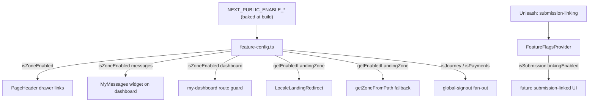

# Feature flags & standalone deployments (citizen-portal)

> Ticket: **AB#39580** — _Feature flagging for consolidated Webapp._

This document is the authoritative reference for the feature flags that
let the consolidated `citizen-portal` app be deployed as a reduced subset
of building blocks. The app README
([`apps/citizen-portal/README.md`](../apps/citizen-portal/README.md))
carries a shorter operator-facing summary; this doc covers the rationale,
the full flag catalogue, the touch points, how to extend it, and the
testing strategy.

## Why this exists

The MessagingIE, Profile and Dashboard building blocks were consolidated
into a single Next.js static export (`citizen-portal`) that serves three
zones (`messages`, `profile`, `dashboard`) from one deployment behind
three nginx `server_name`s. See the README's _"Why one app, three
hostnames"_ section.

A future adopter may want to run a **reduced subset** — for example
MessagingIE without Dashboard (as in the Department of Education
deployment) — without:

- exposing UI elements (nav/drawer links, widgets) that point at building
  blocks that are not deployed,
- redirecting users to a zone that this build does not ship,
- referencing other blocks' origins (e.g. the Journey-Builder sign-out
  fan-out).

The known dependency rules are encoded in the flag design:

- **Every building block requires Profile** — so the profile zone is
  always enabled and has no flag.
- **MessagingIE can run without Dashboard** but always requires Profile.
- **Journey Builder** is a separate block; MessagingIE links to
  submissions only through shared metadata via the API, not a direct
  dependency — so disabling it is a clean, non-breaking config change.

## Flag catalogue

There are two kinds of flag, chosen by what they govern.

### Build-time topology flags (`NEXT_PUBLIC_ENABLE_*`)

Deployment topology is decided at **build/deploy time, never per user**,
so these are plain `NEXT_PUBLIC_*` booleans baked into the static export.
They are parsed in
[`src/env/env.client.ts`](../apps/citizen-portal/src/env/env.client.ts)
(accepting `true`/`false`, `1`/`0`, `yes`/`no`, `on`/`off`, case
insensitive) and read through one helper module,
[`src/lib/feature-config.ts`](../apps/citizen-portal/src/lib/feature-config.ts).
**All default `true`**, so every existing deployment is unchanged.

| Flag | Default | Effect when `false` |
| --- | --- | --- |
| `NEXT_PUBLIC_ENABLE_DASHBOARD` | `true` | Dashboard drawer link hidden; `/{locale}/` never lands on dashboard; a direct visit to `/{locale}/my-dashboard` redirects to the first enabled landing zone; the unmatched-path fallback no longer resolves to dashboard. |
| `NEXT_PUBLIC_ENABLE_MESSAGING` | `true` | MessagingIE drawer link hidden; the recent-messages (`MyMessages`) widget is omitted from the dashboard landing; messaging is no longer offered as a landing fallback. |
| `NEXT_PUBLIC_ENABLE_JOURNEY_INTEGRATION` | `true` | The Journey-Builder sign-out iframe is omitted from the global-signout fan-out (no reference to a Journey-Builder origin). |
| `NEXT_PUBLIC_ENABLE_PAYMENTS_INTEGRATION` | `true` | The Payments sign-out iframe is omitted from the global-signout fan-out. |
| `NEXT_PUBLIC_ENABLE_FORMS_INTEGRATION` | `true` | The Forms sign-out iframe is omitted from the global-signout fan-out. |

`feature-config.ts` exposes:

- `isZoneEnabled(zone)` — `profile` always `true`; `messages` / `dashboard`
  follow their flags.
- `isJourneyIntegrationEnabled()` / `isPaymentsIntegrationEnabled()` / `isFormsIntegrationEnabled`.
- `isLeaEnabled()` — the LEA rollout flag (see below).
- `getEnabledLandingZone(requestedZone)` — returns the requested zone if
  enabled, else the first enabled zone in the order
  `dashboard → messages → profile`. Profile is the terminal fallback
  because it is always enabled. With every flag at its default this
  returns `dashboard` for a dashboard request, preserving the
  pre-AB#39580 behaviour exactly.

### Build-time rollout flag — `NEXT_PUBLIC_ENABLE_LEA` (AB#40267)

Unlike the topology flags above, this is an **environment-specific rollout**
switch for the Life Events Accelerator (LEA) experience, not a deployment
topology flag. It gates two LEA surfaces:

- the **new dashboard**, and
- the **link to an application submission from the message view**.

It differs from the `NEXT_PUBLIC_ENABLE_*` topology flags in two ways:

- **It defaults `false`.** An unconfigured build — and **prod**, which keeps
  the default (non-LEA) version — ships LEA off.
- **The pipeline passes it explicitly.** Because it is env-specific, the
  shared `pipeline-citizen-portal.yml` forwards
  `--build-arg NEXT_PUBLIC_ENABLE_LEA=$(nextPublicEnableLea)`, and the
  per-environment `pipeline-variables/*.yml` set it: **`true` in dev and
  uat, `false` in prod**.

| Flag | Default | Dev | UAT | Prod |
| --- | --- | --- | --- | --- |
| `NEXT_PUBLIC_ENABLE_LEA` | `false` | `true` | `true` | `false` |

It is parsed by the same `booleanFlag` helper in `env.client.ts` and read
through `isLeaEnabled()` in `feature-config.ts`. Gate the LEA surfaces on
`isLeaEnabled()` when they are built; never read `env.NEXT_PUBLIC_ENABLE_LEA`
directly outside `feature-config.ts`.

### Runtime flag — `submission-linking` (Unleash)

Defined in
[`src/components/feature-flags-provider.tsx`](../apps/citizen-portal/src/components/feature-flags-provider.tsx)
and read via `useFeatureFlags().isSubmissionLinkingEnabled`. It is the
**runtime, per-user** gate for messaging surfaces that link a message to
a Journey-Builder submission, toggleable **without a redeploy**.

It defaults **on**: while flags are loading or the Unleash proxy is
unreachable the fallback keeps it enabled, matching a fully-flagged
deployment whose `submission-linking` toggle is on. To hide
submission-linked UI in a deployment that runs Unleash, create the
`submission-linking` flag and turn it off.

Build-time vs runtime split: `NEXT_PUBLIC_ENABLE_JOURNEY_INTEGRATION`
decides whether a deployment *ships* Journey-Builder integration at all;
`submission-linking` decides the *live visibility* of the linked UI
within such a build.

## How the gating flows



### Touch points (the consolidated surface reviewed for AB#39580)

| Area | File |
| --- | --- |
| Flag source of truth | [`src/lib/feature-config.ts`](../apps/citizen-portal/src/lib/feature-config.ts) |
| Flag schema / parsing | [`src/env/env.client.ts`](../apps/citizen-portal/src/env/env.client.ts) |
| Cross-zone drawer links | [`src/components/navigation/page-header.tsx`](../apps/citizen-portal/src/components/navigation/page-header.tsx) |
| Recent-messages widget | [`src/components/dashboard/my-dashboard.tsx`](../apps/citizen-portal/src/components/dashboard/my-dashboard.tsx) |
| Dashboard route guard | [`src/app/[locale]/(authenticated)/my-dashboard/page.tsx`](../apps/citizen-portal/src/app/[locale]/(authenticated)/my-dashboard/page.tsx) |
| Locale-root landing | [`src/components/locale-landing-redirect.tsx`](../apps/citizen-portal/src/components/locale-landing-redirect.tsx) |
| Zone fallback | [`src/util/get-zone-from-path.ts`](../apps/citizen-portal/src/util/get-zone-from-path.ts) |
| Sign-out fan-out | [`src/components/global-signout.tsx`](../apps/citizen-portal/src/components/global-signout.tsx) |
| Runtime submission flag | [`src/components/feature-flags-provider.tsx`](../apps/citizen-portal/src/components/feature-flags-provider.tsx) |

## Configuring a deployment

The flags resolve through Docker `ARG`/`ENV` (default `"true"`) in
[`Dockerfile`](../apps/citizen-portal/Dockerfile) and
[`Dockerfile.local`](../apps/citizen-portal/Dockerfile.local). A
standalone build overrides them:

```bash
docker build \
  --build-arg NEXT_PUBLIC_ENABLE_DASHBOARD=false \
  -f apps/citizen-portal/Dockerfile apps/citizen-portal
```

The shared `pipeline-citizen-portal.yml` deliberately does **not** pass
these *topology* build-args, so the standard CI build inherits the `true`
Dockerfile defaults and current deployments are byte-for-byte unchanged. A
reduced-topology pipeline overrides them at the `--build-arg` level. In
addition, the env parser falls back to the flag's default for any
unrecognised value, so an unset pipeline variable can never accidentally
disable a zone.

The env-specific `NEXT_PUBLIC_ENABLE_LEA` rollout flag (see above) is the
exception: it **is** forwarded by the shared pipeline from the per-env
`nextPublicEnableLea` variable (dev/uat `true`, prod `false`), because its
value must differ by environment rather than inheriting a single default.

Beyond setting the flags, a standalone deployment also simply does not
point an nginx `server_name` / ingress host at the dropped zone.

### Deployment scenarios → flag values

These cover the AB#39580 acceptance outcomes (Profile is always present;
Forms is reached via direct `NEXT_PUBLIC_FORMS_SERVICE_URL` links, not a
citizen-portal zone, so it needs no flag):

| Scenario | `ENABLE_DASHBOARD` | `ENABLE_MESSAGING` | `ENABLE_JOURNEY_INTEGRATION` |
| --- | --- | --- | --- |
| Profile + MessagingIE (no Dashboard) | `false` | `true` | `true` |
| Profile + Forms (no Dashboard, no MessagingIE) | `false` | `false` | `true` |
| Profile + Forms + MessagingIE + Journey Builder (no Dashboard) | `false` | `true` | `true` |
| Profile + Forms + Journey Builder (no Dashboard, no MessagingIE) | `false` | `false` | `true` |

Leave `ENABLE_JOURNEY_INTEGRATION` / `ENABLE_PAYMENTS_INTEGRATION` `true`
unless that building block is genuinely absent from the deployment —
turning them off only removes their sign-out fan-out reference.

## Testing

**Functional (Vitest)** carries the exhaustive combinatorial coverage by
mocking `env.client` / `feature-config` per test:

- [`test/lib/feature-config.test.ts`](../apps/citizen-portal/test/lib/feature-config.test.ts)
  — every zone/flag combination and the landing-fallback order.
- [`test/components/navigation/page-header.test.tsx`](../apps/citizen-portal/test/components/navigation/page-header.test.tsx)
  — drawer links gated per zone.
- [`test/components/dashboard/my-dashboard.test.tsx`](../apps/citizen-portal/test/components/dashboard/my-dashboard.test.tsx)
  — `MyMessages` widget gating.
- [`test/util/get-zone-from-path.test.ts`](../apps/citizen-portal/test/util/get-zone-from-path.test.ts)
  — topology-aware fallback.
- [`test/components/locale-landing-redirect.test.tsx`](../apps/citizen-portal/test/components/locale-landing-redirect.test.tsx)
  — landing redirect target per topology.
- [`test/components/global-signout.test.tsx`](../apps/citizen-portal/test/components/global-signout.test.tsx)
  — journey/payments fan-out gating.
- [`test/components/feature-flags-provider.test.tsx`](../apps/citizen-portal/test/components/feature-flags-provider.test.tsx)
  — `submission-linking` default-on / fallback behaviour.

Run: `pnpm --filter @citizen-portal/app test:local`.

**E2E (Playwright)** — because build-time flags are baked at dev-server
start, disabled-state coverage needs a server booted with the flags off:

- [`e2e/feature-flags/all-enabled.spec.ts`](../apps/citizen-portal/e2e/feature-flags/all-enabled.spec.ts)
  (`@regression`) verifies the fully-enabled experience in the normal
  harness.
- [`e2e/feature-flags/standalone-topology.spec.ts`](../apps/citizen-portal/e2e/feature-flags/standalone-topology.spec.ts)
  runs only under
  [`playwright.flags.config.ts`](../apps/citizen-portal/playwright.flags.config.ts),
  which boots `next dev` with `ENABLE_DASHBOARD=false` and asserts the
  "MessagingIE + Profile, no Dashboard" experience (dashboard link gone,
  `/my-dashboard` redirects to messages).

Run: `pnpm --filter @citizen-portal/app test:e2e:flags:local` (needs the
local-auth harness; the spec is guarded by `CITIZEN_PORTAL_FLAGS_E2E` so
it never runs against the wrong build).

## Adding a new flag

1. Add the `NEXT_PUBLIC_ENABLE_*` var to `env.client.ts` (use the
   `booleanFlag("true")` helper, default `true`) and its `runtimeEnv`
   entry.
2. Expose it through `feature-config.ts` (extend `isZoneEnabled` for a
   new zone, or add an `is<Block>IntegrationEnabled()` helper).
3. Gate the relevant component(s); never read `env.NEXT_PUBLIC_ENABLE_*`
   directly outside `feature-config.ts`.
4. Add the `ARG`/`ENV` pair to `Dockerfile` and `Dockerfile.local` and a
   line to `.env.sample`.
5. Cover it in Vitest (all combinations) and, if it changes a
   user-visible surface, the Playwright flags config.
6. Document it in the table above and in the app README.

## Out of scope (follow-up)

This change is scoped to `apps/citizen-portal`. The following live
elsewhere and are the next surfaces to wire behind `submission-linking`
if/when bidirectional submission linking is actually implemented:

- the `messaging-api` `externalId` field,
- the Journey-Builder messaging plugin,
- the secure-api-gateway `dashboard` → `journey-builder` allowed-resource.
