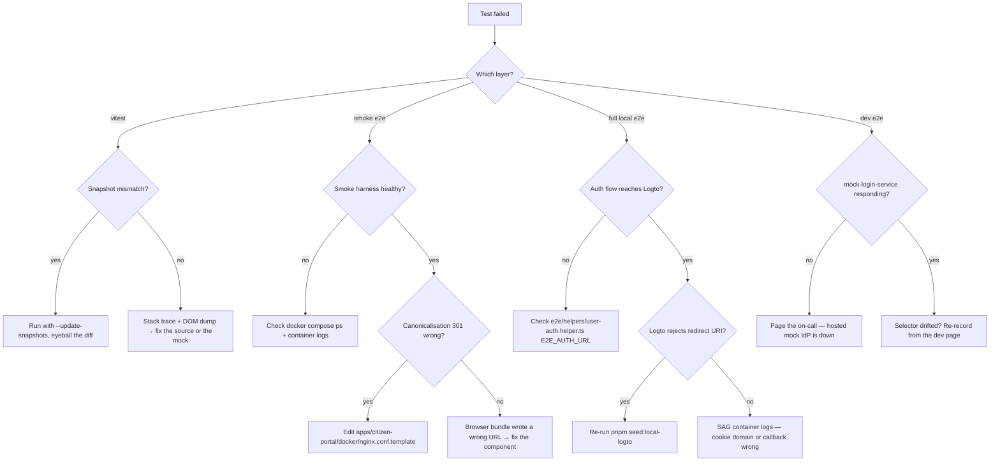

# Testing the consolidated citizen-portal

Single source of truth for every test layer that lives in this repo.
The consolidation (Phase B) collapsed three Next.js apps (`messaging`,
`profile`, `dashboard`) into one unified `@citizen-portal/app` served
by Nginx under three `server_name`s. Every test layer below targets
THAT bundle — the legacy `apps/messaging`, `apps/messaging-next`, and
the `*-admin*` apps still run their own test suites, but those are
out of scope here.

## 1. Test pyramid

```
                        ┌─────────────────────────────────┐
                        │  dev e2e  (auth-bound, hosted)  │  ◄── nightly, real cluster
                        └─────────────────────────────────┘
                      ┌───────────────────────────────────────┐
                      │  full local e2e  (auth-bound, docker) │  ◄── PR + nightly
                      └───────────────────────────────────────┘
                  ┌─────────────────────────────────────────────────┐
                  │  smoke e2e   (no auth, docker harness only)     │  ◄── every PR
                  └─────────────────────────────────────────────────┘
              ┌────────────────────────────────────────────────────────┐
              │  vitest  (jsdom + browser)  — unit, component, integ.  │  ◄── every PR
              └────────────────────────────────────────────────────────┘
       ┌──────────────────────────────────────────────────────────────────────┐
       │  vitest shared  (citizen-shared cross-zone helpers, env schema)      │  ◄── every PR
       └──────────────────────────────────────────────────────────────────────┘
```

| Layer                    | Where it lives                                              | Tool             | Required infra                                                  |
| ------------------------ | ----------------------------------------------------------- | ---------------- | --------------------------------------------------------------- |
| `@citizen-portal/shared` | `packages/citizen-shared/test/**`                           | Vitest (node)    | none                                                            |
| `@citizen-portal/app`    | `apps/citizen-portal/test/**` + `apps/citizen-portal/src/**` | Vitest (jsdom)   | none                                                            |
| Smoke e2e                | `apps/citizen-portal/e2e/smoke/**`                          | Playwright       | citizen-portal docker container on `:8080`                       |
| Full local e2e           | `apps/citizen-portal/e2e/{user,visual,a11y,cross-zone-*}/**` | Playwright       | citizen-portal + SAG + Logto + mygovid-mock-service + postgres + redis |
| Dev e2e (nightly)        | same suites as full local                                   | Playwright       | hosted dev cluster, real Logto + SAG                            |
| Performance              | `apps/citizen-portal/k6/**`                                 | k6               | running citizen-portal target (any environment)                 |

## 2. `pnpm` script → layer mapping

All scripts run from `apps/citizen-portal/` unless flagged.

| Script                            | Layer                          | Required infra |
| --------------------------------- | ------------------------------ | -------------- |
| `pnpm test`                       | vitest (CI flavour, junit XML) | none           |
| `pnpm test:local`                 | vitest (watch mode)            | none           |
| `pnpm test:browser`               | vitest browser provider        | playwright     |
| `pnpm docker:compose:up`          | boots smoke harness only       | docker         |
| `pnpm docker:compose:up:full`     | boots smoke + auth chain       | docker         |
| `pnpm docker:compose:down:full`   | tears down both stacks         | docker         |
| `pnpm seed:local-logto`           | seeds local Logto redirect URIs | local-auth running |
| `pnpm test:e2e:smoke:local`       | smoke e2e                      | smoke harness  |
| `pnpm test:e2e:local:smoke`       | alias for the above (clearer)  | smoke harness  |
| `pnpm test:e2e:local`             | every playwright spec, local URL | smoke harness OR full local |
| `pnpm test:e2e:local:full`        | full local e2e + cross-zone    | full local stack |
| `pnpm test:e2e:dev`               | dev e2e against hosted cluster | VPN, dev creds |
| `pnpm test:e2e:dev:ui`            | same, in playwright UI mode    | VPN, dev creds |
| `pnpm test:smoke:e2e`             | @smoke-tagged subset, hosted SAG | VPN           |
| `pnpm test:regression:e2e`        | @regression+@smoke+@visual, hosted | VPN        |
| `pnpm test:k6:baseline`           | k6 baseline run                | a running target |
| `pnpm test:k6:load`               | k6 load run                    | a running target |
| `pnpm test:k6:compare`            | k6 comparison run              | a running target |
| `pnpm test:k6:all`                | k6 baseline + load             | a running target |
| `pnpm test:k6:route:messages`     | k6 single-route, messages      | a running target |
| `pnpm test:k6:docker`             | k6 wrapped in docker           | docker         |

Plus the root-level workspace scripts:

| Script (run from repo root)                | What it does                  |
| ------------------------------------------ | ----------------------------- |
| `pnpm --filter @citizen-portal/shared test`| Vitest on the shared package  |
| `pnpm --filter @citizen-portal/app test`   | Vitest on the unified app     |

## 3. Running each layer locally

### 3.1 Vitest (every test except e2e)

```bash
# From the repo root — runs BOTH @citizen-portal/shared and @citizen-portal/app
pnpm --filter @citizen-portal/shared test
pnpm --filter @citizen-portal/app test
```

Both are jsdom-based and require no docker, no /etc/hosts entries, and
no network access. Coverage is collected by v8 (`@vitest/coverage-v8`);
the report lands in `apps/citizen-portal/coverage/`.

### 3.2 Smoke e2e (`test:e2e:local:smoke`)

```bash
# One-time prerequisites
sudo sh -c 'echo "127.0.0.1 messaging.local.test profile.local.test dashboard.local.test" >> /etc/hosts'
pnpm docker:build:base                # builds base-deps image (workspace-aware)
cd apps/citizen-portal
pnpm docker:build:citizen-portal:local  # builds citizen-portal:local image

# Every run
cd apps/citizen-portal
pnpm docker:compose:up                # boots citizen-portal on :8080
pnpm test:e2e:local:smoke
```

The smoke suite covers nginx canonicalisation (URL-content parity
across the three zones) and the bundle-built links — it does NOT
require authentication.

### 3.3 Full local e2e (`test:e2e:local:full`)

The full e2e suite needs the auth chain. The compose override in
`apps/citizen-portal/docker-compose.local-auth.yaml` stands up the same
services the dev cluster runs — Logto, mygovid-mock-service, SAG,
postgres, redis — on `*.local.test:8080`.

```bash
# One-time prerequisites (in addition to the smoke ones above):
sudo sh -c 'echo "127.0.0.1 authorization.local.test authorization-admin.local.test secure-api-gateway.local.test mygovid-mock-service.local.test" >> /etc/hosts'

# Side-by-side checkouts (the compose context refers to them):
#   ../@ogcio/logto-utils
#   ../@ogcio/secure-api-gateway

# Every run
cd apps/citizen-portal
pnpm docker:compose:up:full           # boots citizen-portal + SAG + Logto + mygovid + postgres + redis
pnpm seed:local-logto                 # seeds local Logto with citizen-portal redirect URIs
pnpm test:e2e:local:full              # runs every playwright spec including @cross-zone
```

The `test:e2e:local:full` script exports
`E2E_AUTH_URL=http://authorization.local.test:8080/sign-in` so
`e2e/helpers/user-auth.helper.ts` drives the local Logto sign-in form
instead of the hosted one — see [§ 6 below](#6-the-e2e-auth-helper-contract).
It also exports `RUN_CROSS_ZONE_E2E=1`, which un-skips
`e2e/cross-zone-sag-session.spec.ts`.

### 3.4 Dev e2e (`test:e2e:dev`)

```bash
# Requires VPN access + dev credentials in the messaging-dev variable group.
cd apps/citizen-portal
pnpm test:e2e:dev
```

Targets `https://messaging.dev.services.gov.ie` and
`https://authorization.dev.services.gov.ie` directly. Used by the
nightly pipeline; manual runs are fine but slow (no docker, but the
SAG and Logto are remote).

### 3.5 Performance (k6)

See `apps/citizen-portal/k6/README.md` for parameters. The k6 scripts
are environment-agnostic — point them at the target via env vars.

## 4. Coverage targets + reading the v8 report

- `src/util/**` and `src/lib/**`: ≥ 90 % statement coverage.
- `src/components/{navigation,dashboard,profile}/**`: ≥ 70 %.
- Everything else: ≥ 60 %, except the DS-passthrough wrappers in
  `src/components/{client-shell,public-shell,onboarding-shell,…}.tsx`
  which are exercised primarily by e2e.

```bash
pnpm --filter @citizen-portal/app test
open apps/citizen-portal/coverage/index.html
```

## 5. Tag conventions for Playwright specs

- `@smoke` — fast, no-auth, runs on every PR.
- `@regression` — broader auth-bound flows, runs nightly + on demand.
- `@visual` — Argos visual diffs (see `playwright.config.ts`).
- `@a11y` — axe-core scans for WCAG.
- `@cross-zone` — exercises the SAG cookie traversal between
  messaging.* / profile.* / dashboard.*. Skipped unless
  `RUN_CROSS_ZONE_E2E=1`.
- `@blocker-AB#NNNNN-XXXX` — pinned to an AB ticket while a fix is
  being landed. The tag goes away with the ticket.

```bash
# Run a single tag locally
pnpm exec playwright test --grep '@cross-zone'
# Run everything EXCEPT a tag
pnpm exec playwright test --grep-invert '@blocker-AB#38246-sag'
```

## 6. The e2e auth helper contract

`apps/citizen-portal/e2e/helpers/user-auth.helper.ts` is parameterised
on `E2E_AUTH_URL`. The default targets the dev cluster
(`https://authorization.dev.services.gov.ie/sign-in`); the
`test:e2e:local:full` pnpm script overrides it to the local Logto.

The MyGovId-mock form is identical between dev and local
(`@ogcio/logto-utils/apps/mygovid-mock-service` is the upstream for
both), so the selectors that drive the citizen identifiers don't
change between environments. Adding a new citizen identity is two
edits:

1. Add the row to the seeded mock-IdP fixture in
   `@ogcio/logto-utils/apps/mygovid-mock-service/src/fixtures.ts`.
2. Add the matching `case` to the switch in `loginAsCitizen`.

## 7. Failure triage flowchart



## 8. Adding a new test (worked examples)

### 8.1 Zone helper (smallest)

```ts
// apps/citizen-portal/test/util/my-new-helper.test.ts
import { describe, expect, it } from "vitest"
import { myNewHelper } from "@/util/my-new-helper"

describe("myNewHelper", () => {
  it("does the thing", () => {
    expect(myNewHelper("input")).toBe("expected")
  })
})
```

Run: `pnpm --filter @citizen-portal/app test test/util/my-new-helper`.

### 8.2 Component (jsdom + RTL)

Mocks should follow the existing patterns:

- `vi.mock("@ogcio/sag-client/react", () => ({ … }))` — the package
  has ESM resolution quirks under vitest, so stub the constants and
  hooks you actually use.
- `vi.mock("@citizen-portal/shared", () => ({ useCrossZoneLink: …, useEnv: … }))`
  if your component cross-zones.
- DS components can be stubbed as `({ children }) => <div>{children}</div>`
  when you only assert on text + role, never the DS prop surface.

See `test/components/navigation/page-header.test.tsx` for a worked
mock-heavy example.

### 8.3 Playwright spec (full local)

```ts
// apps/citizen-portal/e2e/user/my-new-flow.spec.ts
import { test, expect } from "@playwright/test"
import { loginAsCitizen } from "./helpers/user-auth.helper"

test("a citizen can do the new thing @regression", async ({ page }) => {
  await loginAsCitizen(page, "e2e_citizen_1@user.com")
  await page.goto("/en/messages")
  await expect(page.getByRole("heading", { name: "Inbox" })).toBeVisible()
})
```

Run locally:

```bash
cd apps/citizen-portal
pnpm docker:compose:up:full && pnpm seed:local-logto
pnpm test:e2e:local:full -- --grep "do the new thing"
```

## 9. CI

The Azure pipeline `.azure/pipeline-citizen-portal.yml` runs three
checks on every PR + on every push to `dev`/`uat`:

1. **Build + unit** — `pnpm --filter @citizen-portal/{shared,app} test`
   via the application.yml template.
2. **Smoke e2e** — gated by `smokeTestsEnabled: true` on dev branch.
3. **Image build + deploy** — the citizen-portal docker image is
   pushed and the k8s overlays under
   `messaging-k8s-apps/citizen-portal/overlays/<env>/<cluster>` are
   updated.

The **full local e2e** is intentionally kept out of the PR pipeline
(it'd push runtime past the 15-minute hard cap with the auth-chain
spinup) and runs on the nightly pipeline only. The cross-zone session
spec is tagged `@cross-zone @blocker-AB#38246-sag`; remove the tag
when the AB ticket lands.
